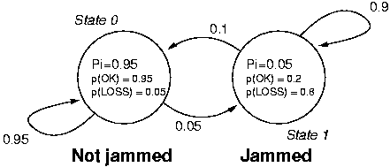

HMM Basics in C#, Part I
=================================

*Hidden Markov Model Evaluation and Decoding - Homework Assignment #2 for COMP 537 Intelligent User Interfaces, Koç University, 2013 Spring*

Introduction and Disclaimer
---------------------------

This is a homework assignment I completed for my COMP 537 Intelligent User Interfaces class at Koç University in the 2013 Spring academic term. The goal of the assignment is to teach the basics of using hidden Markov models (HMMs) for machine learning.

The assignment was done using *C#* and *.NET 4.5*, in a Visual Studio 2012 *Console Application* project. The code I wrote is short and all in one file, **Program.cs**.

I am simultaneously pushing my homework to GitHub and submitting it to the university's network drive. This repository is intended for reference. If you would like to execute the code in Visual Studio, copying and pasting it into your own *Console Application* project and adding a reference to **System.Windows.Forms** should suffice. In addition to the files in the repo, the submission to the network drive includes binaries and the whole of the Visual Studio 2012 project.

I have modified and/or shortened and/or paraphrased parts of the homework brief for clarity, brevity, and to avoid trouble related to sharing work that is not my own. What I have below is my interpretation of the brief, which may or may not be in line with what was originally intended in the assignment. The original brief is not included in the repo, since it is not my work and I have not asked permission to distribute it. The original input data file **testdata.txt** is included since it is data generated by a model that is publicly available elsewhere (and shown below).

This is not the definite solution to these problems, it is but my attempt. I may or may not post the grade and corrections when I receive them.

Preliminaries
-------------

Below are the three canonical problems that must be solved for an HMM to be useful in real-world applications:

1.  **Evaluation.** Given an observation sequence and a model, what is the probability of the model generating that observation sequence?
2.  **Decoding.** Given an observation sequence and a model, what is the most likely sequence of states that has resulted in the observation sequence?
3.  **Learning.** Given an observation sequence, what are the parameters (A, B and &pi;) that best model the process that has generated them?

This assignment deals with the first two problems. The solution to the last problem is the subject of [another repo](http://github.com/mbaytas/hmm-basics-ii).

An observation sequence is created and supplied in **testdata.txt** are created by using the state diagram below (retrieved from the [Jahmm example](https://code.google.com/p/jahmm/wiki/Example)):

HMM parameters that represent the model above are supplied in the file **mymodel.txt**. Other models or observation sequences may be written in the same format as those files and loaded into the program.

The program runs in a console window and presents documentation for available commands on execution:

-  `loadmodel` loads a model from a text file
-  `loadobs` loads an observation sequence from a text file
-  `showmodel` prints current model parameters
-  `showobs` prints current observation sequence
-  `obsv_prob` prints probability of observation sequence given model
-  `obsv_prob log` prints probability of observation sequence given model
-  `viterbi` prints best state sequence, number of state transitions and likelihood, given observation sequence and model
-  `quit` quits
-  `help` shows available commands

Upon launch, the user is expected to:

1. use the `loadmodel`and `loadobs` commands to launch file browser windows and select appropriately formatted text files that contain the model parameters and an observation sequence
2. use the `obsv_prob`, `obsv_prob log` and `viterbi` commands to obtain results

Part 1
------

### The Brief
Take “obsv_prob” as a command, an observation sequence **testdata.txt**, and model parameters **mymodel.txt** as input and return the probability of the given test sequence **P(O|&lambda;)** computed by the Forward algorithm.

### My Solution
The commands `obsv_prob` and `obsv_prob log` call the function `Forward()`, which implements the forward algorithm as described in Rabiner's tutorial. Adding the `log` keyword passes `false` for the `log` parameter of the function, which implements scaling (as described in the same tutorial) and returns log likelihood.

Part 2
------

### The Brief
Take “viterbi” as a command, an observation sequence **textdata.txt**, and model parameters **mymodel.txt** as input and find the best state sequence that explains the given observation sequence. Return the best state sequence, the number of state transitions, and the probabilityof the observation sequence computed over this state sequence.

### My Solution
The functon `Viterbi()` implements the solution to the decoding problem as described in Rabiner's tutorial and returns the desired results.

Notes
-----

-  The original brief asked for the number of possible states in the model as input to the functions, but I determine this from the model.

-  My scaling code is slightly different from the Rabiner tutorial and more in line with César de Souza's implementation.

Resources
----------
-  César de Souza. [Hidden Markov Models in C#](http://crsouza.blogspot.com/2010/03/hidden-markov-models-in-c.html) (5 Dec 2010). Also available on [CodeProject](http://www.codeproject.com/Articles/69647/Hidden-Markov-Models-in-C).

-  L. R. Rabiner. [A tutorial on hidden markov models and selected apllications in speech recognition](http://citeseer.ist.psu.edu/viewdoc/summary?doi=10.1.1.131.2084).  In A. Waibel and K.-F. Lee, editors, Readings in Speech Recognition, pages 267-296. Kaufmann, San Mateo, CA, 1990.

-  [Stack Overflow](http://stackoverflow.com/).

-  [Using Jahmm: simple example](https://code.google.com/p/jahmm/wiki/Example)

-  [Wikipedia: Hidden Markov model](http://en.wikipedia.org/wiki/Hidden_Markov_Models)