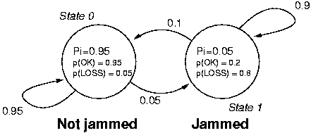

HMM Basics in C#, Part II
=================================

*Hidden Markov Model Learning - Homework Assignment #3 for COMP 537 Intelligent User Interfaces, Koç University, 2013 Spring*

Introduction and Disclaimer
---------------------------

This is a homework assignment I completed for my COMP 537 Intelligent User Interfaces class at Koç University in the 2013 Spring academic term. The goal of the assignment is to teach the basics of using hidden Markov models (HMMs) for machine learning.

The assignment was done using *C#* and *.NET 4.5*, in a Visual Studio 2012 *Console Application* project. The code I wrote is short and all in one file, **Program.cs**.

This repository is intended for reference, the binaries and much of the Vısual Studio 2012 project are omitted. If you would like to execute the code in Visual Studio, copying and pasting it into your own *Console Application* project and adding a reference to **System.Windows.Forms** should suffice.

I have modified and/or shortened and/or paraphrased parts of the homework brief for clarity, brevity, and to avoid trouble related to sharing work that is not my own. What I have below is my interpretation of the brief, which may or may not be in line with what was originally intended in the assignment. The original brief is not included in the repo, since it is not my work and I have not asked permission to distribute it. The original input data file **data.txt** is included since it is data generated by a model that is publicly available elsewhere (and shown below).

This is not the definite solution to these problems, it is but my attempt. I may or may not post the grade and corrections when I receive them.

Preliminaries
-------------

Below are the three canonical problems that must be solved for an HMM to be useful in real-world applications:

1.  **Evaluation.** Given an observation sequence and a model, what is the probability of the model generating that observation sequence?
2.  **Decoding.** Given an observation sequence and a model, what is the most likely sequence of states that has resulted in the observation sequence?
3.  **Learning.** Given an observation sequence, what are the parameters (A, B and &pi;) that best model the process that has generated them?

This assignment deals with the last problem. The solution to the first two problems are the subject of [another repo](http://github.com/mbaytas/hmm-basics-i).

A collection of observation sequences are created and supplied in **data.txt**, using the state diagram below (retrieved from the [Jahmm example](https://code.google.com/p/jahmm/wiki/Example)):

Other observation sequences may be written in the same format and loaded into the program. The program requires that all observation sequences be of the same length.

HMM parameters that represent the model that my program learned from the given observation sequences are supplied in the file **HMMdescription.txt**. 

The program runs in a console window and presents documentation for available commands on execution:

-  `loadobs` loads observation sequences from a text file
-  `showobs` prints current observation sequences
-  `learn` trains a HMM using the given observation sequences
-  `showmodel` prints the current HMM parameters 
-  `savemodel` saves the current HMM to a file
-  `quit` quits
-  `help` shows available commands

Upon launch, the user is expected to:

1. use the `loadobs` command to launch a file browser window and select an appropriately formatted text file that contain the observation sequences
2. use the `learn` command to train a HMM using the loaded observation sequences
3. use the `showmodel` command to view the learned model
4. use the `savemodel` command to launch a file browser window and write the model to a file

### The Brief
Take “learn” as a command and a file containing observation sequences, **data.txt**, as input; and train a HMM. Write the description of the HMM to a file **HMMdescription.txt**. The description should include the transition probabilities matrix *A*, emission probabilities matrix *B* and initial state probabilities vector *π*.

### My Solution
The `learn` calls the function `Learn()`, which implements the Baum-Welch algorithm as described in [Rabiner's tutorial](http://citeseer.ist.psu.edu/viewdoc/summary?doi=10.1.1.131.2084) and [Shen's paper](http://courses.media.mit.edu/2010fall/mas622j/ProblemSets/ps4/tutorial.pdf). The comments in the code explain the workings of the function.

Notes
-----

-  The original brief asked for the number of possible states in the model as input. I determine this from the model, assuming that the number of possible states is equal to the number of unique observations in the observation sequences.

-  I did not use scaling since the learning algorithm works well without it.

-  When I did not use scaling, underflow occurred when I calculated forward probability over multiple sequences. When I used scaling, the same situation resulted in overflow. Rather than using the probability of multiple sequences as my criterion for having learned the model, I run the algorithm for a fixed number of iterations (hard-coded to be 10,000 in this case). A friend of mine suggested the [log-sum-exp trick](http://www.youtube.com/watch?v=-RVM21Voo7Q&list=PLD0F06AA0D2E8FFBA&index=104) to get around this problem. For my purposes, capping the number of iterations worked fine.

- After I have officially submitted the code, the TA pointed out that it is not a good idea to assume, as I did, that the number of states in the model is the same as the number of unique observations in the given sequences. A user may choose to train a model with a different number of states for various reasons. It is indeed a desirable feature to take the number of states as input from the user.

Resources
----------

- [mathematicalmonk's YouTube channel](http://www.youtube.com/user/mathematicalmonk)

-  Dawei Shen. [Some Mathematics for HMM](http://courses.media.mit.edu/2010fall/mas622j/ProblemSets/ps4/tutorial.pdf) (12 Oct 2008).

-  César de Souza. [Hidden Markov Models in C#](http://crsouza.blogspot.com/2010/03/hidden-markov-models-in-c.html) (5 Dec 2010). Also available on [CodeProject](http://www.codeproject.com/Articles/69647/Hidden-Markov-Models-in-C).

-  L. R. Rabiner. [A tutorial on hidden markov models and selected apllications in speech recognition](http://citeseer.ist.psu.edu/viewdoc/summary?doi=10.1.1.131.2084).  In A. Waibel and K.-F. Lee, editors, Readings in Speech Recognition, pages 267-296. Kaufmann, San Mateo, CA, 1990.

-  [Stack Overflow](http://stackoverflow.com/).

-  [Using Jahmm: simple example](https://code.google.com/p/jahmm/wiki/Example)

-  [Wikipedia: Hidden Markov model](http://en.wikipedia.org/wiki/Hidden_Markov_Models)