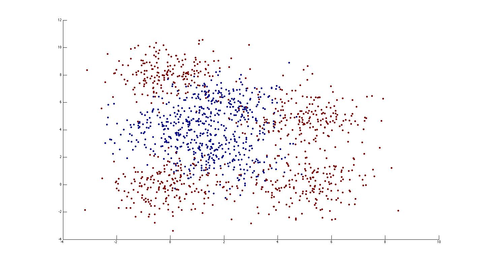
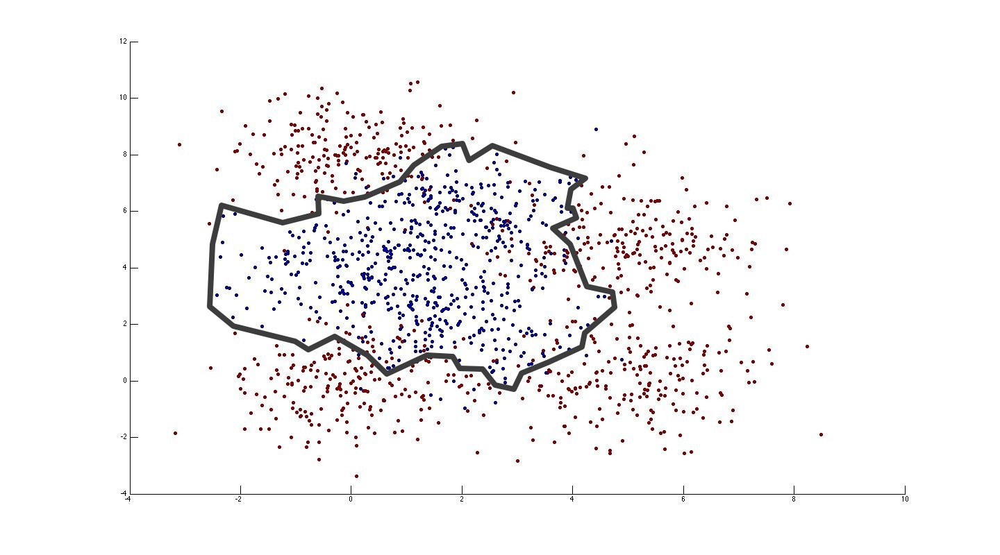
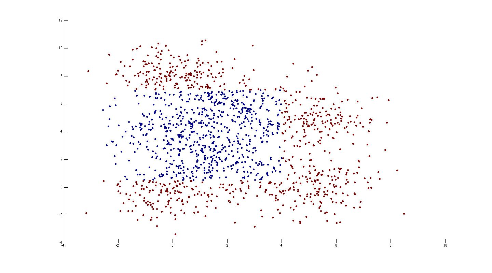
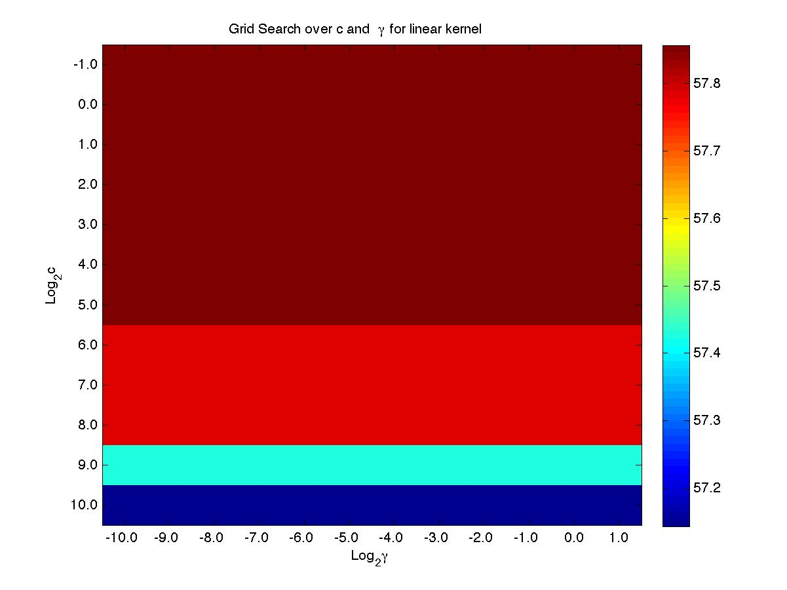
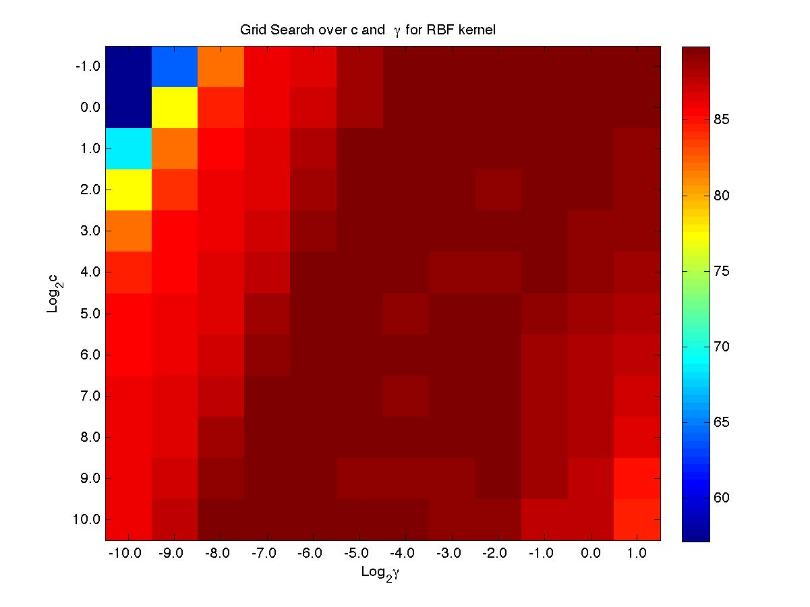
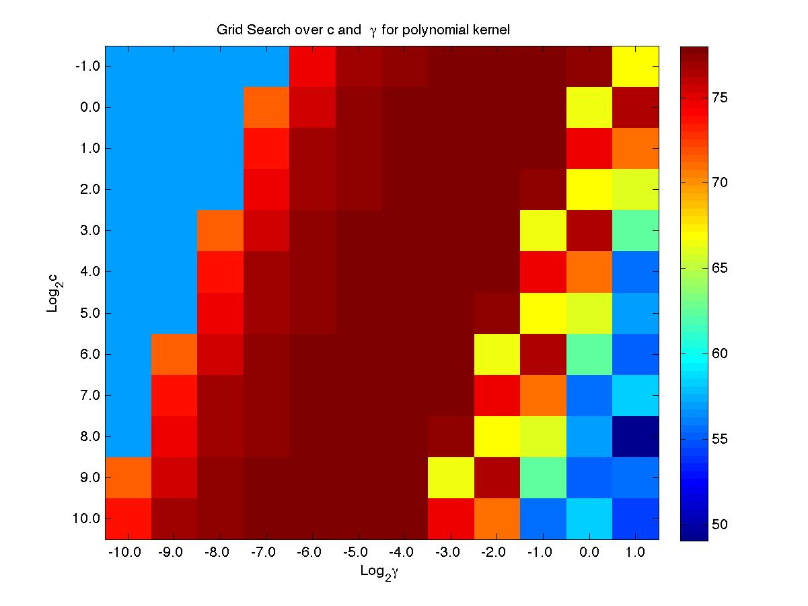

SVM Basics with MATLAB and libsvm
=================================

*Homework Assignment #1 for COMP 537 Intelligent User Interfaces, Koç University, 2013 Spring*

Introduction and Disclaimer
---------------------------

This is a homework assignment I completed for my **COMP 537 Intelligent User Interfaces** class at Koç University in the 2013 Spring academic term. The goal of the assignment is to teach the basics of using support vector machines (SVMs) for classification by machine learning.

This is the actual homework submission. I expect this repo to be read and graded by the professor and/or the TA.

The assignment, by requirement, was done in MATLAB. The [libsvm](http://www.csie.ntu.edu.tw/~cjlin/libsvm/) package, or more specifically, [charlesztt](https://github.com/charlesztt)'s [libsvm binaries for OS X](https://github.com/charlesztt/charlesztt-tools-libsvm-macosx-matlab-compiled) were used to train and test the classifiers. I did not include libsvm or the binaries in the repo, but they are freely available. If you would like to execute my code on Mac OS X, downloading the binaries from their repo and placing them in the ´libsvm´ folder should work. All **.m** files are stand-alone executable scripts.

I have modified and/or shortened and/or paraphrased parts of the homework brief for clarity, brevity, and to avoid trouble related to sharing work that is not my own. I found parts of the original homework brief to be confusing; what I have below is my interpretation of the brief, which may or may not be in line with what was originally intended in the assignment. The original brief is not included in the repo, since it is not my work and I have not asked permission to distribute it. The original input data file **input.txt** is included; I presume it is randomly generated data.

This is not the definite solution to these problems, it is but my attempt. I may or may not post the grade and corrections when I receive them.

Part A
------

### The Brief
Tou are given an input file of points on a 2D plane. Each point has three numeric attributes: Its X-coordinate, its Y-coordinate, and its color. The color attribute is 1 if the point is red and 0 if the point is black. Load the data in the input file and produce a 2D plot of the coordinates and color labels of the input points.

### My Solution
The code in **PartA.m** loads the data in the input file into MATLAB and produces a scatter plot *(Fig. 1)*.

*Fig.1: Scatter plot of the input data.*

Part B
------

### The Brief
Manually draw a decision boundary separating red and black points from each other.

### My Solution
See *Fig. 2*.

*Fig.2: Manually drawn decision boundaries.*

Part C
------

### The Brief
Write a classifier using only if/else conditions for separating the red and black points. Use the x and y coordinate values to decide whether a point is red or black. Use a maximum of 20 conditions. Test your classifier on the input file. Document the accuracy of your classifier (number of correctly labeled points / number of all points) along with a plot of the predicted color labels. Include a confusion matrix for your classifier.

### My Solution
I started with a labels vector full of 1's (red) and used 3 conditions for my classifier to predict 0's (black): `x < 4`, `y > 0.5`, and `y < 7`. My classifier, implemented in **PartC.m**, yielded the following results *(Fig. 3)*:

*Total \# of points:* 1400

*\# of correctly labeled points:* 1205

*Accuracy:* 86.07%

*Confusion matrix:*
<pre>
544   56
139  661
</pre>

*Fig.3: Color labels predicted by the if/else classifier.*

Part D
------

### The Brief

Using [libsvm](http://www.csie.ntu.edu.tw/~cjlin/libsvm/), train 3 different SVMs for the input file: First using a linear kernel, then using a radial basis function (RBF) kernel and lastly, using a polynomial kernel. For all SVMs:

1.  Using 5-fold cross-validation, perform a grid search to find the optimal cost and gamma parameters. Plot a 2D color map that shows the cross-validation accuracy value for cost and gamma values tried during grid search. Perform grid search over ranges `-1 ≤ log2c ≤ 10` and `-10 ≤ log2g ≤ 1`.

2.  Using 5-fold cross-validation, train your SVM and test its accuracy.

For each SVM, report the number of support vectors you have in your trained model and the accuracy of your classifier. Submit each SVM in a seperate `.m` file.

In your report, give brief explanations to the following questions: 

-  What is the purpose of cross-validation in machine learning?

-  What is the purpose of grid search in machine learning?

### My Solution

First off, the answers to the questions:

The purpose of using **cross-validation** in machine learning is to make sures that every data point from a mixed dataset (with training and testing data combined) has the same probability of appearing in the training and testing sets. As such, cross-validation can be used to compare models or architectures to determine which one of the available approaches is more suitable to the solution of a given problem.

A **grid search** is an exhaustive searching through a specific subset of the parameters of a learning algorithm. The performance of the parameters evaluated in grid sarch is guided by performance metrics measured using cross-validation on the training set. As such, grid search is used for determining the optimal parameters for a specific model or architecture chosen to solve a problem.

Second, a brief overview of what's happening in the SVM code:

First I read and process the CSV data to re-write an **input.train** file using `libsvmwrite()`, since the original data was not in the libsvm format. Then I grid search over the ranges of `log2c` and `log2g` and call `svmtrain()` in each iteration with the options `-q` (quiet mode), `-t T` (kernel type T), `-v 5` (5-fold cross-validation), `-c C` (cost parameter C) and `-g G` (gamma parameter G). The kernel type option is set to `-t 0` to enforce a linear kernel, `-t 1` for a polynomial kernel and `-t 2` for an RBF kernel (see the libsvm documentation for a full guide to the options). `svmtrain()` used in this manner returns a single `double` accuracy value. I use the accuracy in every iteration to plot the color map and decide on the best values for the cost and gamma parameters.

After grid search comes the part where I plot the color map from the results and save it. The code here is inspired heavily by [this example](https://sites.google.com/site/kittipat/libsvm_matlab/demo_libsvm_crossvalidation) from [Kittipat's libsvm for MATLAB pages](https://sites.google.com/site/kittipat/libsvm_matlab).

Finally, I call `svmtrain()` again, with the same options minus `-q` for quiet mode, which allows it to display valuable information like the number of support vectors in the MATLAB console.

Now, to the SVMs...

#### SVM with linear kernel

See *(Fig. 4)* for the grid search results and **PartDlinear.m** for code.

*Fig.4: Color map for grid search over cost and gamma for linear kernel*

*Best c:* 32

*Best g:* 2

*\# of support vectors:* 960

*Cross-validation accuracy:*: 57.8571%

#### SVM with RBF kernel

See *(Fig. 5)* for the grid search results and **PartDrbf.m** for code.

*Fig.5: Heat map for grid search over cost and gamma for RBF kernel*

*Best c:* 1

*Best g:* 0.25

*\# of support vectors:* 316

*Cross-validation accuracy:*: 89.8571%

#### SVM with polynomial kernel

See *(Fig. 6)* for the grid search results and **PartDpolynomial.m** for code.

*Fig.6: Heat map for grid search over cost and gamma for polynomial kernel*

*Best c:* 1024

*Best g:* 0.0313

*\# of support vectors:* 607

*Cross-validation accuracy:*: 78%

Notes
-----

-  The grid searches in part D may take a while to run.

-  When called using the option `-v K` (for K-fold cross-validation), `svmtrain()` returns a single `double` value, which is its cross-validation accuracy percentage, e.g. the function returns 98.7654 for 98.7654% accuracy. When called without this option, the function returns a model vector, which is to be used for future prediction. More details on using `svmtrain()` and `svmpredict()` in MATLAB can be found in the package documentation.

-  Part D of the assignment originally specified using "5-fold cross-validation to separate the input file into training/validation and test data and using "5-fold cross-validation to further separate the training/validation data into training and validation data." I re-interpreted these instructions to yield the above, preferring to exploit libsvm's built-in cross-validation capabilities.

-  The three SVM scripts are nearly exactly the same, save for the appropriate `-t` parameters and presentation material.

-  The values on the y-axis on the heat maps decrease as they move from bottom to top.

Resources
----------

-  [charlesztt-tools-libsvm-macosx-matlab-compiled](https://github.com/charlesztt/charlesztt-tools-libsvm-macosx-matlab-compiled)

-  Chih-Chung Chang and Chih-Jen Lin, LIBSVM : a library for support vector machines. ACM Transactions on Intelligent Systems and Technology, 2:27:1--27:27, 2011. Software available at [http://www.csie.ntu.edu.tw/~cjlin/libsvm](http://www.csie.ntu.edu.tw/~cjlin/libsvm)

-  [Kittipat's libsvm for MATLAB pages](https://sites.google.com/site/kittipat/libsvm_matlab)

-  [Stack Overflow: Is cross-validation used to find the best model/architecture OR the best parameters of a model/architecture?](http://stackoverflow.com/questions/10093090/is-cross-validation-used-to-find-the-best-model-architecture-or-the-best-paramet)

-  [Wikipedia: Cross-validation (statistics)](http://en.wikipedia.org/wiki/Cross-validation_(statistics))

-  [Wikipedia: Hyperparameter optimization](http://en.wikipedia.org/wiki/Hyperparameter_optimization)